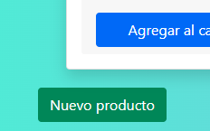

# **Backend Coderhouse - Proyecto Final**

## Winehouse - Tienda de vinos

El objetivo del proyecto es proveer un proyecto en nodejs que cumpla con la consigna del trabajo final del curso de Backend de Coderhouse.

El proyecto se encuentra alojado en Render y puede accederse mediante la siguiente URL [https://whinehouse.onrender.com](https://whinehouse.onrender.com)

**Caracteristicas**

*Modulos*
 - Node JS
 - Express
 - Passport
 - Mongoose (MongoDB)
 - Handlebars/Pug/Ejs (Plantillas)
 - Socket.IO
 - Nodemailer

*Rutas*
Ruta|Metodo|Accion|Autenticado|Tipo parametros|Tipo respuesta
-|-|-|-|-|-
/api/productos/|GET|Lista todos los productos|Si|N/A|json
/api/productos/|POST|Agrega un producto|Si|json|json
/api/productos/:id|GET|Obtiene el detalle del producto identificado por :id|Si|N/A|json
/api/productos/:id|PUT|Actualiza el producto identificado por :id|Admin|json|json
/api/productos/:id|DELETE|Elimina el producto identificado por :id|Admin|N/A|json
/api/productos/categoria/:categoria|GET|Lista todos los productos de la categoria :categoria|Si|N/A|json
/api/carrito/|POST|Crea un nuevo carrito|Si|N/A|json
/api/carrito/:id|DELETE|Elimina el carrito identificado por :id|Si|N/A|json
/api/carrito/:id/productos|GET|Lista todos los productos del carrito :id|Si|N/A|json
/api/carrito/:id/productos/|POST|Agrega un producto al carrito :id|Si|json|json
/api/carrito/:id/productos/|DELETE|Vacia el carrito :id|Si|N/A|json
/api/carrito/:id/productos/:id_prod|DELETE|Elimina el producto :id_prod del carrito :id|Si|N/A|json
/api/carrito/:id/productos/count|GET|Devuelve la cantidad de productos del carrito :id|Si|N/A|json
/api/carrito/:id/purchase|POST|Genera la orden de compra segun el contenido del carrito :id|Si|N/A|json
/api/usuario/info|GET|Devuelve la informacion del usuario autenticado|No|N/A|json
/api/usuario/profile|GET|Devuelve el perfil completo del usuario registrado|Si|N/A|json
/api/chat|GET|Devuelve todos los chats no leidos/leidos|Admin|N/A|json
/api/chat|POST|Agrega una nueva respuesta al chat de un usuario y marca los mensajes como leidos|Admin|json|json
/api/chat/:usuario|GET|Devuelve todos los chats de :usuario|Admin|N/A|json
/api/ordenes|GET|Devuelve las órdenes del usuario autenticado|Si|N/A|json
/login|GET|Devuelve la vista de login|No|N/A|html
/login|POST|Autentica un usuario|No|json|json
/logout|GET|Elimina la sesion del usuario autenticado|Si|N/A|html
/signup|GET|Devuelve la vista de registro|No|N/A|html
/signup|POST|Crea un nuevo usuario|No|multipart/form-data|json
/products|GET|Devuelve la vista de productos|Si|N/A|html
/profile|GET|Devuelve la vista de perfil de usuario|Si|N/A|html
/cart|GET|Devuelve la vista de carrito|Si|N/A|html
/chat|GET|Devuelve la vista de mensajeria|Si|N/A|html
/chat:usuario|GET|Devuelve la vista de mensajeria de :usuario|Admin|N/A|html
/serverconfig|GET|Devuelve la vista de informacion del servidor (Plantilla Pug)|Si|N/A|html
/serverparams|GET|Devuelve la vista de parametros de configuracion del servidor (Plantilla Handlebars)|Si|N/A|html
/geterror500|GET|Simula un error interno del servidor para obtener la vista de error 500 (Plantilla Ejs)|No|N/A|html

## Guia de usuario

Al ingresar a la web se visualiza la vista raiz:

La barra de navegación:

El acceso a cualquiera de las opciones por parte de un usuario no autenticado deriva a la pagina de ingreso:

En la misma se puede acceder a la pagina de registro:

Una vez autenticado el usuario puede acceder a la vista de productos:

Y a la página con los datos de usuario:

En caso que el usuario ya haya realizado pedidos las ordenes aparecerán al final, haciendo clic en ver se podrá visualizar el detalle de la orden:

Por ultimo podrá acceder al centro de mensajes:

## Guia de administrador
Los usuarios administradores deben crearse de manera manual con el campo isAdmin: true en la colección de usuarios.
La cualidad de administrado le permite operaciones especiales en ciertas vistas.
En la vista de productos, aparece un boton para agregar nuevos productos al final de la pagina:

En cada producto aparecen dos iconos que permiten editar o eliminar el producto:

Al ingresar al chat se pueden ver los mensajes de todos los usuarios agrupados entre no leidos y leidos:

Haciendo clic en ver se puede enviar una respuesta al usuario:

Aquí se puede enviar una respuesta esta acción marca por leídos los mensajes), solo marcar como leidos o volver atras.

